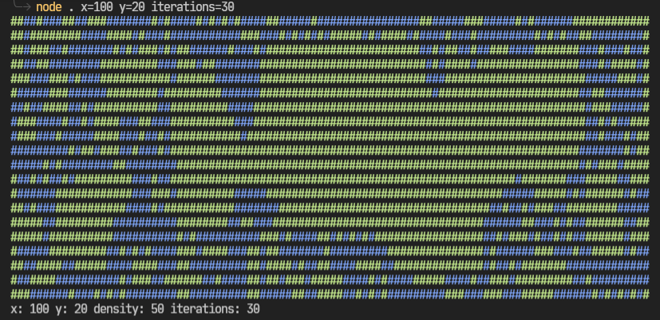

# 🦠 cellular-automata

An implementation of cellular automata in TypeScript.

# 📚 Usage

First of all, clone the repository:

```sh
$ git clone git@github.com:aroace/cellular-automata.git
$ cd cellular-automata
```

Then, install the dependencies:

```sh
$ yarn install
```

Build the project:

```sh
$ yarn build
```

Finally, run the project:

```sh
$ node .
```

# 📝 Examples

```sh
$ node .
$ node . x=200 y=100 density=50 iterations=10
```


